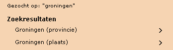
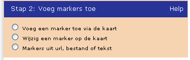
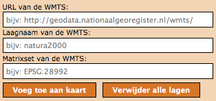
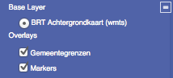
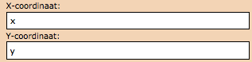

PDOK Kaart Wizard
=================

Zoek een locatie
----------------

Voordat u een kaart voor uw website gaat maken, zult u eerst naar de
plaats op de kaart willen gaan waarvoor u de kaart wilt maken. Dit kan door direct in de kaart in– en uit te zoomen met behulp van de knop 

|knop zoom in/uit| 

en de kaart naar de gewenste plaats te verschuiven.

Om de kaart te schuiven, dient u in de kaart te klikken, de
linkermuisknop ingedrukt te houden en met de muis te bewegen. Een
snellere manier om naar de gewenste plek te gaan, is door het invoeren
van een adres, postcode of plaatsnaam in het zoekschermpje. 

|zoekscherm|

De kaart zoomt direct naar de opgegeven locatie. Wanneer er meerdere resultaten zijn gevonden, wordt een keuzelijstje geopend:

|keuzelijst|

Door op één van zoekresultaten te klikken, zoomt de kaart in op de
locatie.

Stap 1: De Kaart
----------------

In stap 1 kunt u instellen hoe groot u uw kaart wilt hebben. U kunt
kiezen tussen de formaten 

- klein (300 \* 250 pixels)
- middel (400 \* 350 pixels)
- groot (550 \* 440 pixels)

|image4.png|

Kies de grootte van de kaart

Het kaartbeeld aan de rechterzijde wordt direct aangepast aan uw keuze. Het voorbeeldkaartje aan de rechterzijde komt hiermee exact overeen met het eindresultaat. De "Toon knop kaartlagen" staat standaard aan en heeft betrekking op het wel of niet beschikbaar zijn van de knop aan de rechterkant van de
kaart 

|image5.png|

Met deze knop is het mogelijk om eventuele extra kaartlagen aan of uit te zetten.

|image6.png|

Voor het toevoegen van extra kaartlagen zie optie “extra kaartlaag
toevoegen”.
 
Stap 2: Voeg markers toe
------------------------

In stap 2 kunt u één of meerdere markers toevoegen. Met een marker
wordt bedoeld een punt, een lijn of een vlak. In stap 2 is het ook
mogelijk om de markers te wijzigen of te verwijderen. De markers kunnen
ook uit een bestand worden ingelezen. Het aantal markers dat toegevoegd
kan worden, is onbeperkt.

|image7.png|

Voeg een marker toe via de kaart
................................

Door de eerste optie aan te vinken, wordt een lijst geopend met
markers. Bovenaan de lijst staan de markers voor het prikken van punten,
middenin de lijst de markers voor het trekken van de lijnen en onderaan
de markers voor het intekenen van de vlakken. Na het selecteren van een
marker voor een puntsymbool kan de gewenste positie van de marker in de
kaart worden geprikt (voor een punt) of getekend (voor een lijn of een
vlak). Het afsluiten van een vlak of een lijn gebeurt met een dubbele
muisklik. Nadat de marker is aangebracht kan deze voorzien worden van
een titel en een omschrijving in het tekstvak dat geopend is. In de
tekst kunnen ook URL links worden opgenomen bijvoorbeeld :code:`<a
href="http://www.theaterdemusketon.nl">Theater de Musketon</a>`.

|image8.png|

De tekst kan bewaard worden met de knop “Opslaan tekst”. De tekst kan
achteraf nog gewijzigd worden bij de functie “wijzig een marker op de
kaart.” Indien gewenst kan de marker direct verwijderd worden met de
knop “Verwijderen marker”.

Wijzig een marker op de kaart
.............................

Door de optie “wijzig een marker op de kaart” aan te vinken kunnen
bestaande markers verplaatst of verwijderd worden. Dit kan door na het
aanvinken van de optie “wijzig een marker op de kaart” de marker (punt,
lijn of vlak) in de kaart te selecteren. De geometrie van de marker kan
vervolgens worden aangepast. Ook kunnen de titel en de omschrijving van
de marker aangepast worden. De tekstwijzigingen worden opgeslagen met de
knop “Opslaan tekst”.

Naast het wijzigen van de marker kan deze ook verwijderd worden met
de knop “Verwijderen marker”.
 
Marker uit URL, bestand of tekst
................................

Door de optie “Marker uit URL, bestand of tekst” aan te vinken kunnen
markers ingelezen worden die volgens een bepaalde standaard zijn
gedefinieerd. Er worden twee standaarden ondersteund KML en TXT.

**KML** Voor meer informatie over het KML formaat zie `de documentatie van Google <https://developers.google.com/kml/documentation/>`_.

**TXT** Het gaat hierbij om een YX-tekstbestand met coördinaten in RD. Het
scheidingsteken is een `tab`. In geval van RD is de volgende input vereist (inclusief koptekst):

::

    point	title	description
    517000,117960	tekst1	omschrijving1
    517200,117200	tekst2	omschrijving2

.. NOTE:: In de hierbovenstaande tabel moeten de gegevens door een `TAB` gescheiden worden!

.. NOTE:: Vooralsnog moet eerst de Y worden vermeld en dan de X. Dit wordt in een later stadium aangepast.

Via URL
.......

|image9.png|

Kies het type definitie (KML of TXT) en geef de URL waar het bestand
met markerdefinities zich bevindt. Klik daarna op "Haal op ". De markers
die in het bestand zijn gedefinieerd worden direct op de kaart
ingetekend. Vanwege webbeveiliging kunnen alleen KML- en TXT-betanden in
PDOK Kaart gebruikt worden die staan op Google Maps, PDOK.nl of Dropbox.
Wanneer de URL van het KML- of TXT-bestand naar een ander domein
verwijst, volgt een melding over de Proxy. Het te gebruiken KML- of
TXT-bestand dient dus op Google Maps, PDOK.nl (Forum) of een eigen
Dropbox-account (public) te worden gezet.

Via Copy/Paste
..............

Indien de markerdefinities in een bestand staan dat niet via een URL
kan worden benaderd dan kunnen de markerdefinities ook handmatig via
copy/paste aan de kaart worden toegevoegd. Dit als alternatief voor het
plaatsen van de KML of TXT op Google Maps, PDOK.nl of Dropbox. Deze
optie kan ook worden gekozen om de locatie of de teksten van de markers
te wijzigen.

Kies allereerst het type definitie (KML of TXT). Kopieer de
markerdefinities uit het bronbestand naar de markerdefinities in de
tekstbox.

De markerdefinities kunnen uiteraard ook met de hand worden ingevoerd
en daarnaast kunnen de gekopieerde markerdefinities worden aangepast
voordat ze in de kaart worden opgenomen. Kies “Opslaan om de markers aan
de kaart toe te voegen. De markers worden direct op de kaart ingetekend.

|image10.png|

Voorbeeld van tekst die hierin kan worden gekopieerd (scheidingsteken
is een tab):

::

	point	title	description
	517000,117960	tekst1	omschrijving1
	518000,117200	tekst2	omschrijving2

Na in het toevoegen kunnen de markers met ‘Wijzig een marker op de kaart’ worden aangepast of verwijderd.

Stap 3: Genereer code
---------------------

Wanneer deze stap gekozen wordt dan wordt code gegenereerd voor:

#. een URL link
#. een iFrame
#. een Object tag
#. HTML en JavaScript code voor in de head en body sectie van een HTML pagina

Naar wens kan één van de vier gegenereerde opties gebruikt worden.
Functioneel leveren zij alle hetzelfde resultaat. Aan de eerste drie
opties zit echter wel een beperking. Deze kunnen niet gebruikt worden
wanneer de lengte van de URL link de maximum toegestane lengte van een
URL in de gebruikte browser overschrijdt. De lengte is verschillend per
type browser. Wanneer de lengte van de URL langer is dan 2000 karakters
dan wordt dat door PDOK Kaart gemeld. De lengte van de URL wordt bepaald
door het aantal markers, de grootte van de titel en omschrijving van de
markers en het aantal kaartlagen. Na plaatsing van plusminus 5 markers
met tekst, wordt de URL langer dan 2.000 karakters en is alleen optie 4
beschikbaar. Het is bekend dat sommige CMS-systemen niet goed met optie
4 om kunnen gaan. Een uitweg is in die gevallen om de markers op te
nemen in een apart KML-bestand en vervolgens vanuit PDOK Kaart deze KML
aan te roepen. Op die wijze kan de uiteindelijke URL onder de 2.000
karakters blijven. Zie voor verdere uitleg de “veelgestelde vragen
m.b.t. PDOK Kaart”.

URL link
........

De gegenereerde URL link kan direct in het navigatieveld van een
willekeurige browser worden gekopieerd. Daarnaast kan de link direct per
e-mail verstuurd worden. Kies hiervoor het mail icoontje |image11.png|
Er wordt een nieuw e-mail bericht aangemaakt met in de body de URL link.
Pas de e-mail aan en verstuur deze. De ontvangers kunnen op de URL link
klikken waarna de gedefinieerde PDOK Kaart wordt getoond. Bij de URL
link wordt de kaart altijd beeldvullend getoond.

iFrame of Object tag
....................

Kopieer, afhankelijk van de wens of er gebruik gemaakt moet worden
van een iFrame of een HTML object, de gegenereerde code en plak deze in
het HTML document waar de kaart moet worden opgenomen. De grootte van de
getoonde kaart is afhankelijk van de keuze die gemaakt is in stap 1.

HTML en JavaScript
..................

De HTML en JavaScript optie kan als basis gebruikt worden door meer
geavanceerde gebruikers om de getoonde kaart naar de eigen behoefte aan
te passen. De gegenereerde code van de Head en de Body sectie van een
HTML pagina worden gegenereerd. Deze code dient in de betreffende sectie
te worden gekopieerd. Bij deze optie wordt geen rekening gehouden met de
keuze die gemaakt is in Stap 1: Kies de grootte van de kaart. Men dient
zelf maatregelen te nemen om de kaart grootte naar eigen wens weer te
geven.

Optie: Extra Kaartlaag toevoegen
--------------------------------

Met deze extra optie kunnen er voorgedefinieerde PDOK kaartlagen of
andere WMS of WMTS kaartlagen toegevoegd worden aan de kaart. De
kaartlagen worden op elkaar gelegd in de volgorde waarin zij toegevoegd
worden. De eventueel toegevoegde markers liggen altijd bovenop de
bovenste kaartlaag en zijn dus altijd zichtbaar.

Het aantal kaartlagen dat toegevoegd kan worden is onbeperkt (alleen
voor optie 4 van “genereer code”). De volgorde van de kaartlagen is niet
te wijzigen en een individuele kaartlaag is niet te verwijderen. Met de
optie ‘Verwijder alle lagen” kunnen echter wel alle kaartlagen, behalve
de achtergrond kaart en de markers, verwijderd worden.

Voeg een standaard kaartlaag toe

|image12.png|

Met deze optie kunnen voorgedefinieerde PDOK kaartlagen worden
toegevoegd. Selecteer een kaart uit de lijst en kies “Voeg toe aan
kaart”. De geselecteerde kaart wordt aan de kaart toegevoegd en het
resultaat is direct zichtbaar. Let wel dat bepaalde PDOK kaartlagen niet
op alle schaalniveaus zichtbaar zijn.

Voeg een WMS kaartlaag toe
..........................

|image13.png|

Met deze geavanceerde optie kunnen eigen WMS kaarten worden
toegevoegd. Typ de URL van de WMS webservice in het veld “URL van de
WMS” en één of meerdere kaartlagen, gescheiden door een komma, in het
veld “Kaartlagen van de WMS”.

Kies daarna voor “Voeg toe aan kaart” om de kaartlagen toe te voegen
aan de kaart. Om deze optie succesvol te kunnen gebruiken dient men
kennis te hebben van WMS webservices.

Voeg een WMTS kaartlaag toe
...........................

|image14.png|

Met deze geavanceerde optie kunnen eigen WMTS kaarten worden
toegevoegd. Typ de URL van de WMTS webservice in het veld “URL van de
WMTS”, de naam van de kaartlaag in het veld “Kaartlaag van de WMTS” en
de naam van de matrix set in het veld “Matrixset van de WMTS”. Kies
daarna voor “Voeg toe aan kaart” om de kaartlaag toe te voegen aan de
kaart.
Om deze optie succesvol te kunnen gebruiken dient men kennis te
hebben van WMTS webservices.
 
Verwijder alle lagen
....................

Met deze optie worden alle toegevoegde kaartlagen verwijderd.

.. NOTE:: Sommige kaarten zijn niet op elk zoomniveau beschikbaar. Vaak moet er ingezoomd worden voordat de kaart getoond wordt. Het kan dus voorkomen dat het lijkt alsof een kaart niet toegevoegd is. Om na te gaan welke kaartlagen er voorkomen kan gebruikt worden gemaakt van de kaartlagenknop die zich rechts bovenin de kaart bevindt (tenminste als deze in stap 1: Toon kaartlagen knop niet uitgevinkt is).

|image15.png|

Kies deze knop en de aanwezige kaartlagen worden getoond.

Optie: Kaartprikker functionaliteit toevoegen
---------------------------------------------

Met de geavanceerde kaartprikker functionaliteit heeft u de
mogelijkheid om bezoekers van uw website, waarin u een PDOK Kaart hebt
opgenomen, de mogelijkheid te geven een marker op de kaart te zetten
(prikken). Deze marker kan een punt, lijn of vlak zijn. Tevens kunt u
aangeven tussen welke zoomniveaus de bezoeker mag prikken.

Selecteer een teken object
..........................

|image16.png|

Geef aan welke geometrie uw bezoeker gaat gebruiken voor het
intekenen van een marker en geef daarna aan waar de gegevens van de
getekende geometrie in de HTML pagina moet worden 'opgeslagen' zodat
deze voor u beschikbaar is voor verdere verwerking.

|image17.png|

Voor een punt(xy) dienen de namen van de attributen voor de waarde
van de x en de y coördinaat te worden opgegeven.

|image18.png|

Voor een punt(WKT), lijn(WKT) en een vlak(WKT) dient u de naam van
het attribuut op te geven waarin de wkt informatie wordt opgeslagen.
Voor meer informatie over het WKT formaat zie `Wikipedia <http://en.wikipedia.org/wiki/Well-known_text>`_ .

|image19.png|

U kunt aangeven tussen welke zoomniveaus een bezoeker van uw website
de marker in de kaart mag tekenen.

Om de kaartprikker optie succesvol te kunnen gebruiken dient men (basale) programmeerkennis te hebben.

--------------

.. |PDOK| image:: img/PDOK-logo.png
.. |knop zoom in/uit| image:: ./images/help/image1.png
.. |zoekscherm| image:: ./images/help/image2.png

.. |image4.png| image:: ./images/help/image4.png
.. |image5.png| image:: ./images/help/image5.png
.. |image6.png| image:: ./images/help/image6.png

.. |image8.png| image:: ./images/help/image8.png
.. |image9.png| image:: ./images/help/image9.png
.. |image10.png| image:: ./images/help/image10.png

.. |image12.png| image:: ./images/help/image12.png
.. |image13.png| image:: ./images/help/image13.png

.. |image16.png| image:: ./images/help/image16.png

.. |image18.png| image:: ./images/help/image18.png
.. |image19.png| image:: ./images/help/image19.png
